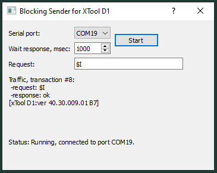

# Exploring the X-Tool Serial port

Yes, it does support some GRBL thru the  serial port.

# A python serial approach 

setwifi.py is a an example the sets the wifi SSID and paswword via the serial port.
It's more complicated than it needs to be for this simple task. It shows how to
make a polling thread so you don't block the main thread waiting for replies.

note that X-Tool D1 needs a newline terminator on the serial commands.
If the SSID and PW are correct you get a response with the ip address.

    setwifi.py

    sending: M2001 "TP-LINK_9BE2" "your__pw"

    Press Ctrl-C to stop polling. Waiting for IP address reply...
    read result:b'ok\n'
    read result:b'M2001 192.168.0.106\n'
    wait for polling thread to finish
    all done

## python3-serial

On the Orange Pi 5B, running Ubuntoo

    sudo apt-get install python3-serial

# A Qt example 

I was messing around with Candle2, trying to get it to talk to the X-Tool.

Let's put on a cpp hat and learn some Qt.

The Qt "Blocking Master Example" was tweaked get some useful interaction with the X-Tool D1.

* [Qt Blocking Master Doc] [qtdoc]
* [Qt example source code] [qtgit]

## Adjustments to Suit X-Tool

  * Baudrate: 230400
  * command terminator is a newline, 0x0a

Without the newline terminator the XTool does nothing.

Code snippets from senderthread.cpp:

        // serial port setup for XTool D1
        serial.setBaudRate(230400);
        serial.setParity(QSerialPort::NoParity);
        serial.setDataBits(QSerialPort::Data8);
        serial.setFlowControl(QSerialPort::NoFlowControl);
        serial.setStopBits(QSerialPort::OneStop);

        // XTool D1 commands require a newline terminator
        requestData.append(0x0a);

## To build and run blockingsender

To get a log on the console, build the debug version. 

        cd blockingsender
        qmake
        make debug

And, run it:

        debug/blockingsender.exe

Press start to get the sender thread going then just use the keyboard "Enter" to send text.

Send a blank line ("\n" added automatically) .. Xtool responds with "ok" ... and perhaps other stuff in its output buffer. 

Some sample debug output showing responses to ?, $I, and $H. Yes, $H really does perform a homing operation to the upper left.

Why the upper left? Why is the Y-axix inverted? Because SVG and the web and all sorts of places in the SW world, that's the way it is.

        sent:  "?\n"
                     recv:  "ok\n<MPos:0.000000,0.000000,0.000000,0.000000>\n"
        sent:  "\n"
                     recv:  "ok\n"
        sent:  "$I\n"
                     recv:  "[xTool D1:ver 40.30.009.01 B7]\nok\n"
        sent:  "\n"
                     recv:  "ok\n"
        sent:  "$H\n"
                     recv:  "ok\n"
        sent:  "\n"
                     recv:  "start_home x \r\nleft limit trigged\r\nstart_home y \r\nup limit trigged\r\n<MPos:0.000000,0.000000,0.000000>\nM28\nok\n"
        sent:  "\n"
                     recv:  "ok\n"
        sent:  "$I\n"
                     recv:  "ok\n[xTool D1:ver 40.30.009.01 B7]\n"

[qtdoc]: https://doc.qt.io/qt-5/qtserialport-blockingmaster-example.html

[qtgit]: https://github.com/qt/qtserialport/tree/dev/examples/serialport/blockingsender
